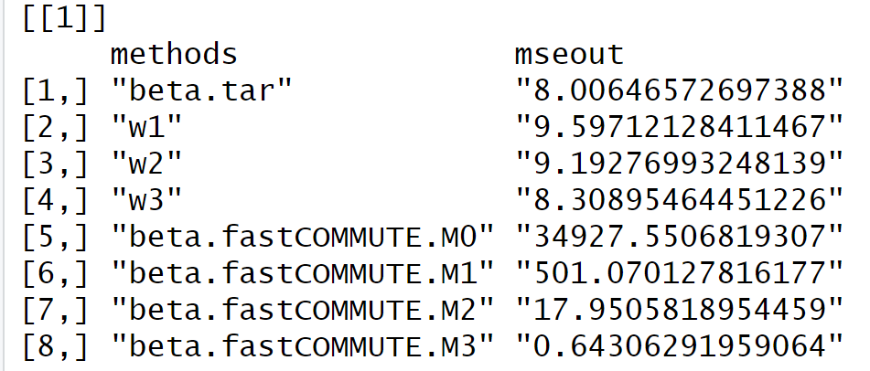

```{r, packages loading and default set,echo = FALSE, message = FALSE, warning = FALSE}
# load necessary packages
library(tidyverse)
library(dplyr)
library(readxl)
library(rvest)
library(kableExtra)

# set knitr defaults
knitr::opts_chunk$set(
               echo      = TRUE,
	             cache     = TRUE,
               prompt    = FALSE,
               tidy      = FALSE,
               comment   = NA,
               message   = FALSE,
               warning   = FALSE,
               dpi       = 150,
               fig.height= 12,
               fig.width= 12,
               fig.align = "center")
# set theme defaults
theme_set(
  theme_bw() +
  theme(
    legend.position = "bottom"
    , plot.title    = element_text(hjust = 0.5)
    , plot.subtitle = element_text(hjust = 0.5)    
    , plot.caption  = element_text(hjust = 0.0)
  )
)

# set color scale defaults
options(
    ggplot2.continuous.colour = "gradient"
  , ggplot2.continuous.fill   = "gradient"
)
scale_colour_discrete = scale_colour_viridis_d
scale_fill_discrete   = scale_fill_viridis_d
```


# n0=100,p=200,h=0


# n0=100,p=200,h=10


# n0=1000,p=200,h=10


# n0=10000,p=200,h=10


# n0=100,p=2000,h=10


# n0=100,p=200,h=60


# n0=100,p=200,h=10 MSE Comparison



